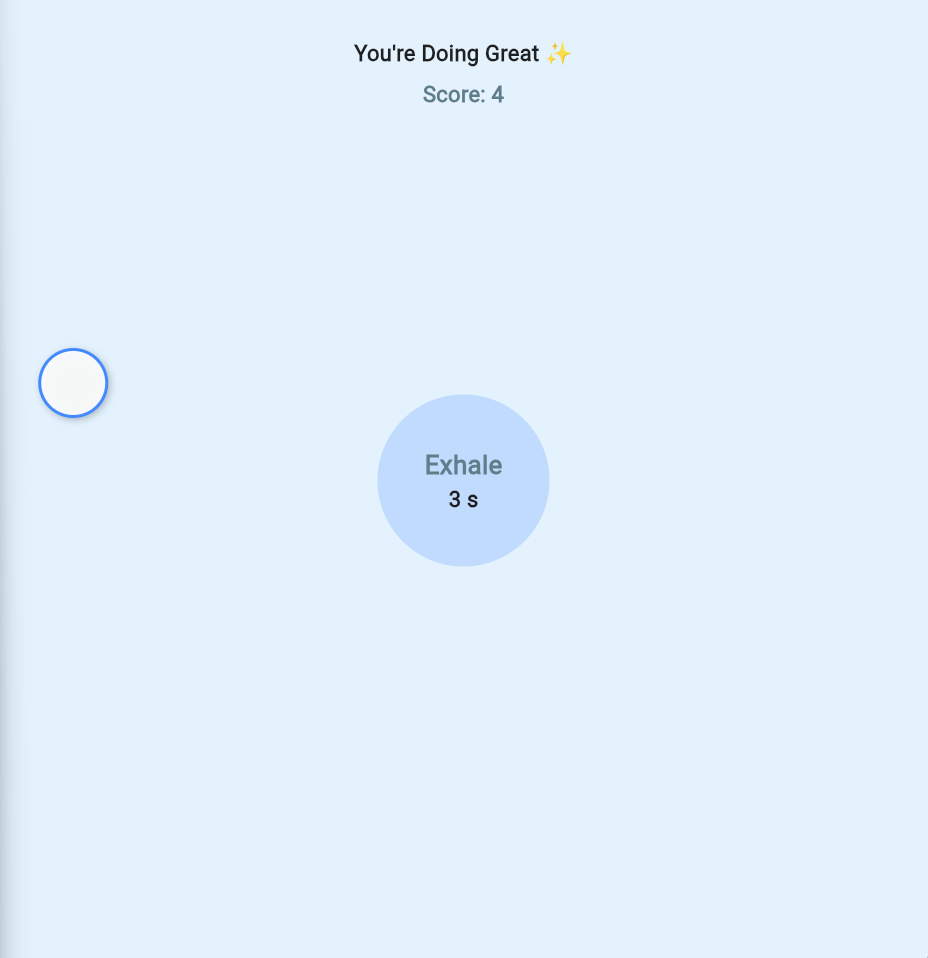

# 🌿 CalmBreath – A Relaxing Breathing & Focus Game (Flutter)

CalmBreath is a beautifully minimal, relaxing Flutter app designed to help users:

🧘 Reduce stress

🎯 Improve focus

🌬️ Practice mindful breathing

🫧 Stay calm with a simple interaction game

The app blends breathing exercises with a gentle bubble-tapping activity, creating a soothing, meditative experience.

## ✨ Features
### 🫁 Guided Breathing (Inside the Bubble)

INHALE → HOLD → EXHALE

Smooth expanding/contracting breathing circle

Timer shown inside the bubble

Helps regulate breathing patterns gently

### 🫧 Relaxing Bubble Game

A single bubble moves left ↔ right slowly

Designed to be calm and predictable (no randomness)

Difficulty increases very gently:

Score 0–24 → Very Slow

Score 25–49 → Slow

Score 50+ → Normal

Tap the bubble → Score + Quote

Tap anywhere else → Score resets

### 🌟 Positive Affirmations

Each bubble tap shows a calming quote at the top:

“Stay Calm”
“You’re Doing Great”
“Focus on Peace”
and more…

### 🎨 Minimal & Peaceful UI

Soft colors

Gentle motion

Smooth animations

Perfect for short mindful breaks

### 📸 App Preview

  

### 🚀 How to Run
git clone https://github.com/<your-username>/<repo>/  
cd <repo>  
flutter pub get  
flutter run

🧩 Project Structure
lib/
 └── main.dart
assets/
 └── screenshot.png

### 🎯 Why This App Exists

CalmBreath promotes relaxation and mental well-being using:

Guided breathing

Gentle movement

Cognitive light focus

Positive reinforcement

### 🛠 Built With

Flutter

Dart

AnimationController

Tween & CurvedAnimation

GestureDetector

### 📄 License

Open-source. Feel free to modify and extend.
